# OS-Linux-commands-Shell-scripting
Operating Systems Lab Exercise

# Linux Commands - Shell Scripting

## AIM
To practice Linux Commands and Shell Scripting.

## DESIGN STEPS

### Step 1:
Navigate to any Linux environment installed on the system or installed inside a virtual environment like virtual box/vmware or online linux JSLinux (https://bellard.org/jslinux/vm.html?url=alpine-x86.cfg&mem=192) or docker.

### Step 2:
Execute the following commands

### Step 3:
Testing the commands for the desired output.

---

# COMMANDS

## Create the following files file1, file2 as follows:

```bash
cat > file1
chanchal singhvi
c.k. shukla
s.n. dasgupta
sumit chakrobarty
^d
```

```bash
cat > file2
anil aggarwal
barun sengupta
c.k. shukla
lalit chowdury
s.n. dasgupta
^d
```

## Display the content of the files

```bash
cat < file1
```
## OUTPUT
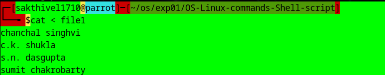

```bash
cat < file2
```
## OUTPUT
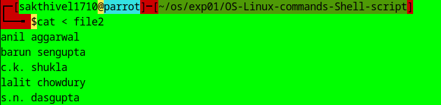

---

# Comparing Files

```bash
cmp file1 file2
```
## OUTPUT
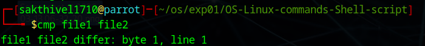

```bash
comm file1 file2
```
## OUTPUT
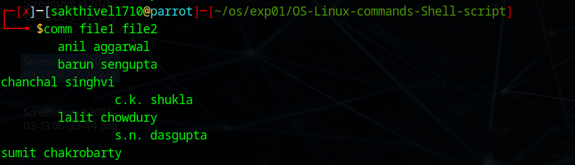

```bash
diff file1 file2
```
## OUTPUT

---

# Filters

## Create the following files file11, file22 as follows:

```bash
cat > file11
Hello world
This is my world
^d
```

```bash
cat > file22
1001 | Ram | 10000 | HR
1002 | tom |  5000 | Admin
1003 | Joe |  7000 | Developer
^d
```

```bash
cut -c1-3 file11
```
## OUTPUT
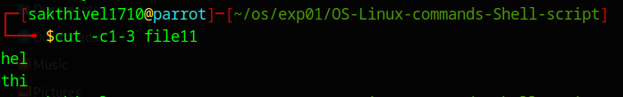

```bash
cut -d "|" -f 1 file22
```
## OUTPUT
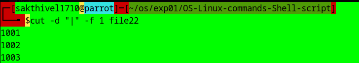

```bash
cut -d "|" -f 2 file22
```
## OUTPUT
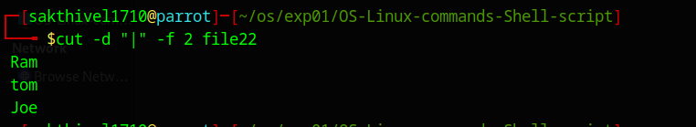

```bash
cat > newfile
Hello world
hello world
^d
```

```bash
grep Hello newfile
```
## OUTPUT
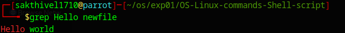

```bash
grep hello newfile
```
## OUTPUT
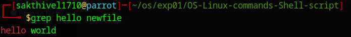

```bash
grep -v hello newfile
```
## OUTPUT
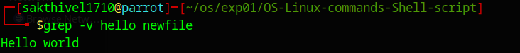

```bash
cat newfile | grep -i "hello"
```
## OUTPUT


```bash
cat newfile | grep -i -c "hello"
```
## OUTPUT
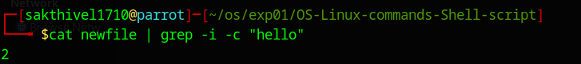

```bash
grep -R ubuntu /etc
```
## OUTPUT
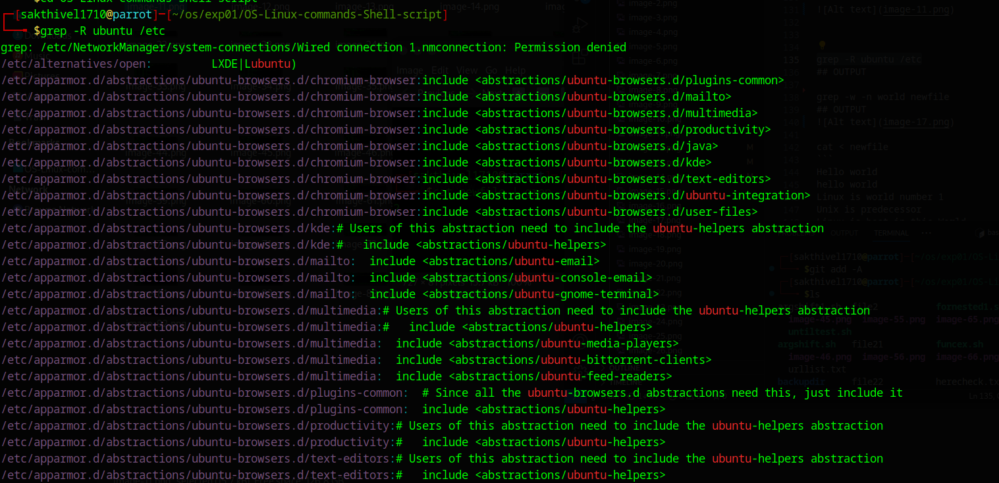
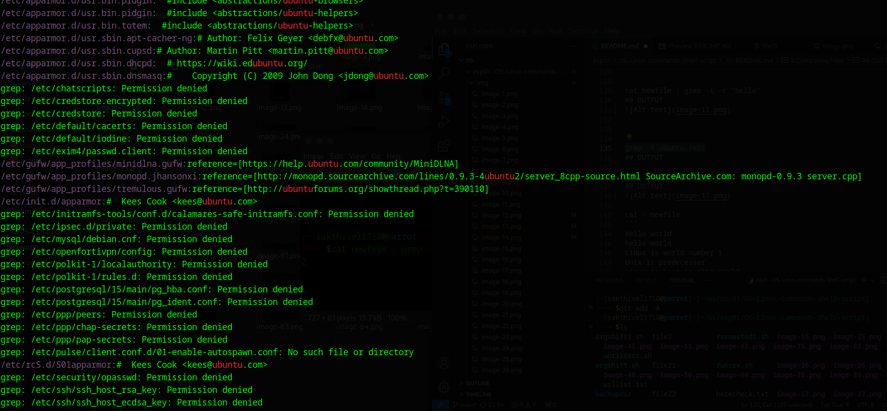
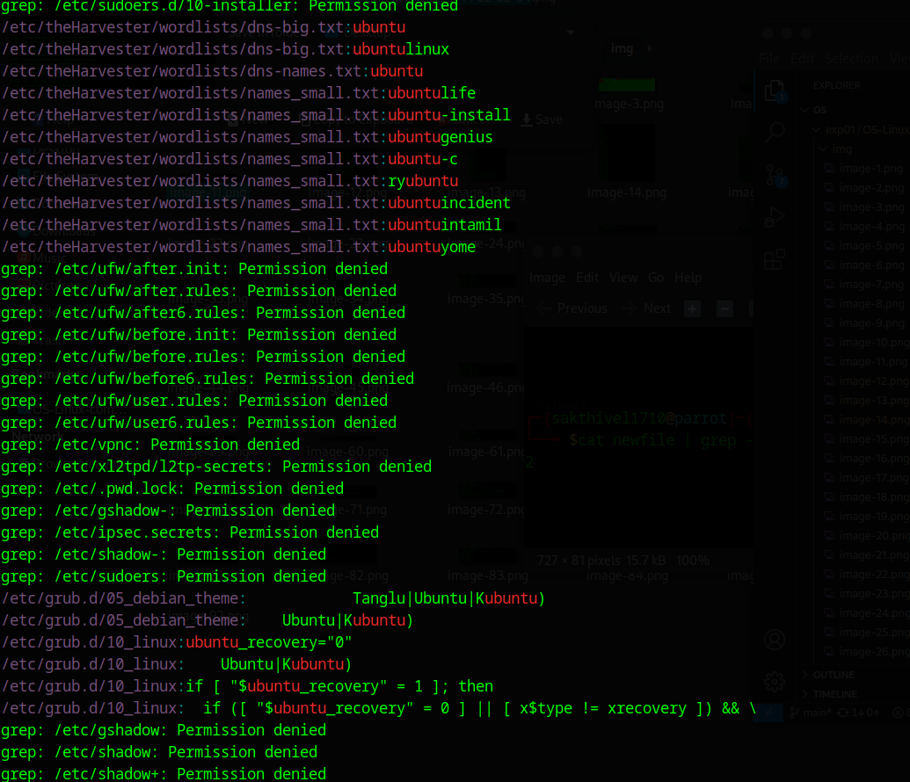
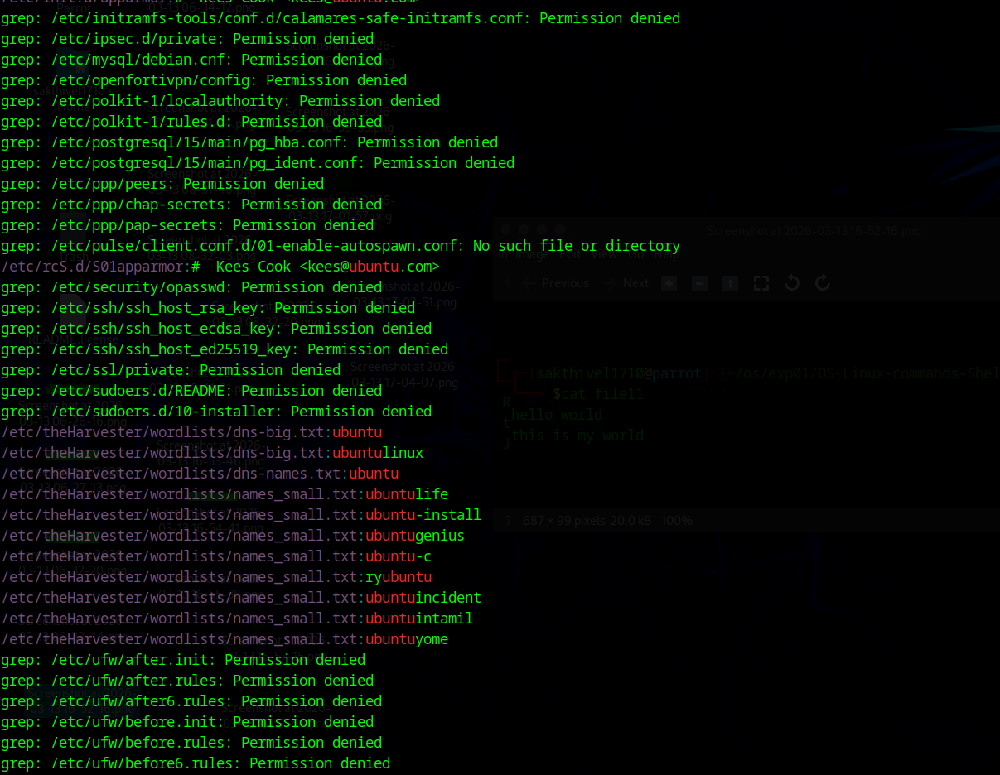
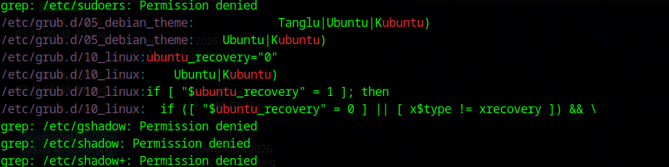

```bash
grep -w -n world newfile
```
## OUTPUT


```bash
cat > newfile
Hello world
hello world
Linux is world number 1
Unix is predecessor
Linux is best in this World
^d
```

```bash
egrep -w 'Hello|hello' newfile
```
## OUTPUT
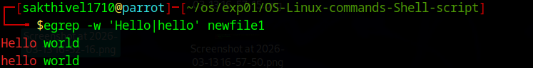

```bash
egrep -w '(H|h)ello' newfile
```
## OUTPUT
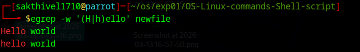

```bash
egrep -w '(H|h)ell[a-z]' newfile
```
## OUTPUT
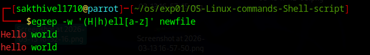

```bash
egrep '(^hello)' newfile
```
## OUTPUT
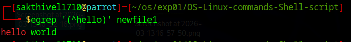

```bash
egrep '(world$)' newfile
```
## OUTPUT


```bash
egrep '(World$)' newfile
```
## OUTPUT
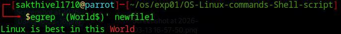

```bash
egrep '((W|w)orld$)' newfile
```
## OUTPUT
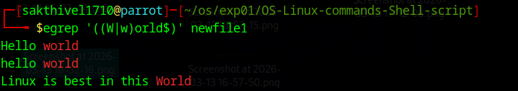

```bash
egrep '[1-9]' newfile
```
## OUTPUT
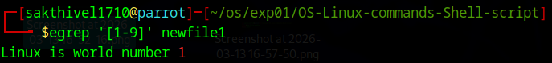

```bash
egrep 'Linux.*world' newfile
```
## OUTPUT


```bash
egrep 'Linux.*World' newfile
```
## OUTPUT
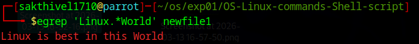

```bash
egrep l{2} newfile
```
## OUTPUT
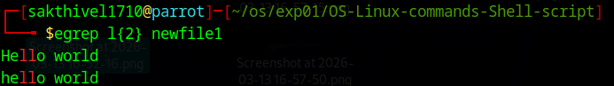

```bash
egrep 's{1,2}' newfile
```
## OUTPUT
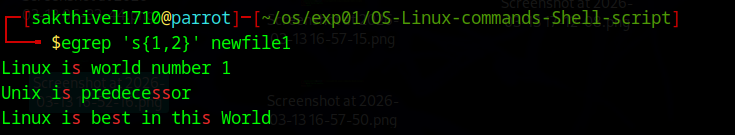

---

# sed Command

## Create file23

```bash
cat > file23
1001 | Ram | 10000 | HR
1001 | Ram | 10000 | HR
1002 | tom |  5000 | Admin
1003 | Joe |  7000 | Developer
1005 | Sam |  5000 | HR
1004 | Sit |  7000 | Dev
1003 | Joe |  7000 | Developer
1001 | Ram | 10000 | HR
^d
```

```bash
sed -n -e '3p' file23
```
## OUTPUT
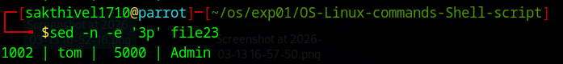

```bash
sed -n -e '$p' file23
```
## OUTPUT
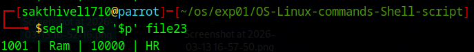

```bash
sed -e 's/Ram/Sita/' file23
```
## OUTPUT
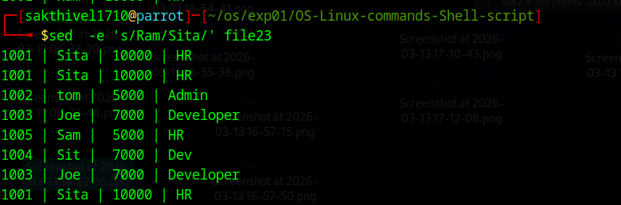

```bash
sed -e '2s/Ram/Sita/' file23
```
## OUTPUT
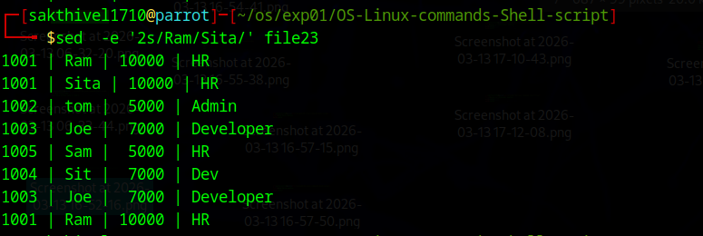

```bash
sed '/tom/s/5000/6000/' file23
```
## OUTPUT
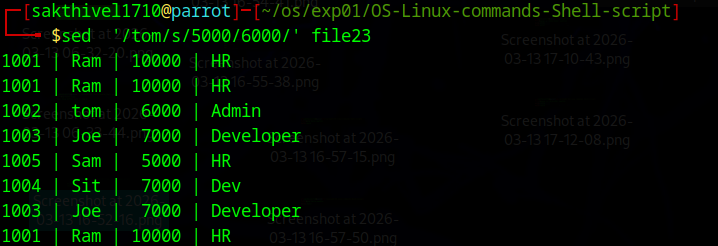

```bash
sed -n -e '1,5p' file23
```
## OUTPUT
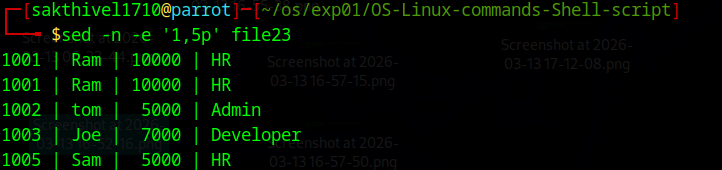

```bash
sed -n -e '2,/Joe/p' file23
```
## OUTPUT
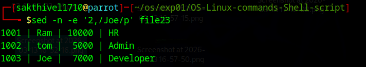

```bash
sed -n -e '/tom/,/Joe/p' file23
```
## OUTPUT
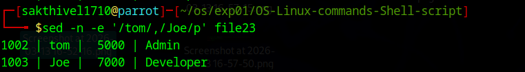

```bash
seq 10
```
## OUTPUT
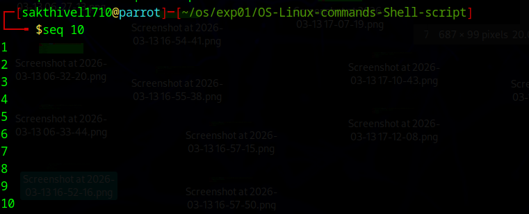

```bash
seq 10 | sed -n '4,6p'
```
## OUTPUT
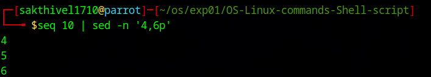

```bash
seq 10 | sed -n '2,~4p'
```
## OUTPUT
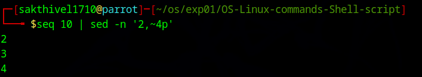

```bash
seq 3 | sed '2a hello'
```
## OUTPUT
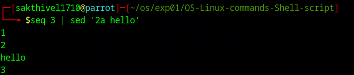

```bash
seq 2 | sed '2i hello'
```
## OUTPUT
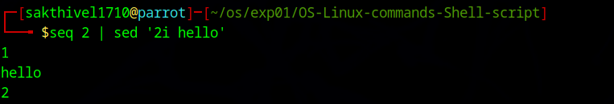

```bash
seq 10 | sed '2,9c hello'
```
## OUTPUT
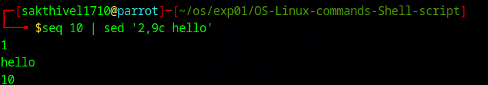

```bash
sed -n '2,4{s/^/$/;p}' file23
```
## OUTPUT
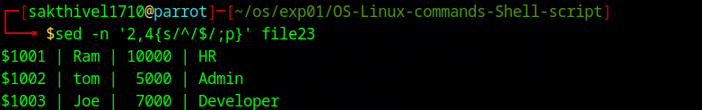

```bash
sed -n '2,4{s/$/*/;p}' file23
```
## OUTPUT
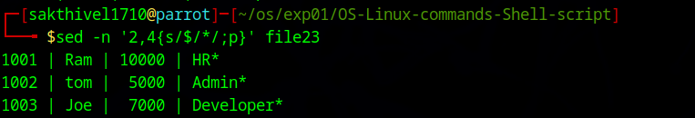

---

# Sorting File Content

```bash
cat > file21
1001 | Ram | 10000 | HR
1002 | tom |  5000 | Admin
1003 | Joe |  7000 | Developer
1005 | Sam |  5000 | HR
1004 | Sit |  7000 | Dev
^d
```

```bash
sort file21
```
## OUTPUT
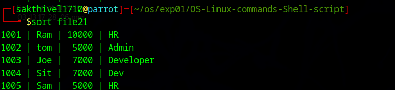

```bash
cat > file22
1001 | Ram | 10000 | HR
1001 | Ram | 10000 | HR
1002 | tom |  5000 | Admin
1003 | Joe |  7000 | Developer
1005 | Sam |  5000 | HR
1004 | Sit |  7000 | Dev
^d
```

```bash
uniq file22
```
## OUTPUT
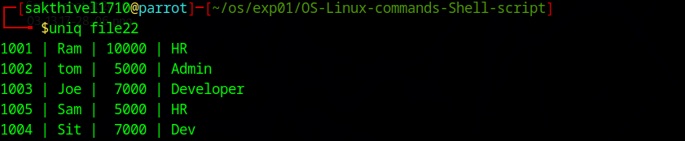

---

# Using tr Command

```bash
cat file23 | tr [:lower:] [:upper:]
```
## OUTPUT
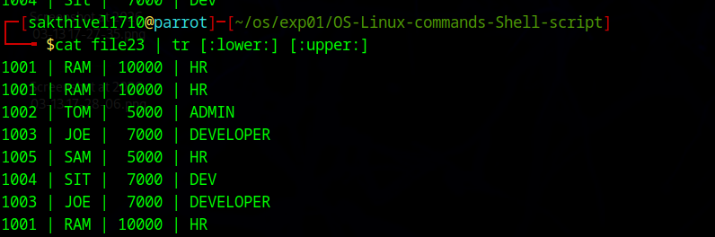

```bash
cat > urllist.txt
www. yahoo. com
www. google. com
www. mrcet.... com
^d
```

```bash
cat urllist.txt | tr -d ' '
```
## OUTPUT
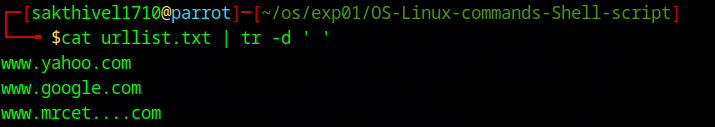

```bash
cat urllist.txt | tr -d ' ' | tr -s '.'
```
## OUTPUT
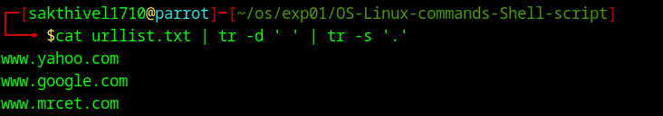

---

# Backup Commands

```bash
tar -cvf backup.tar *
```
## OUTPUT
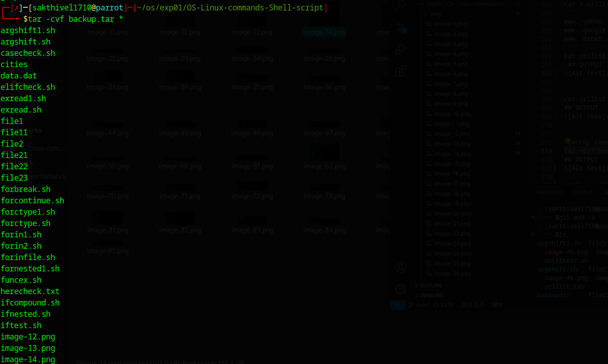
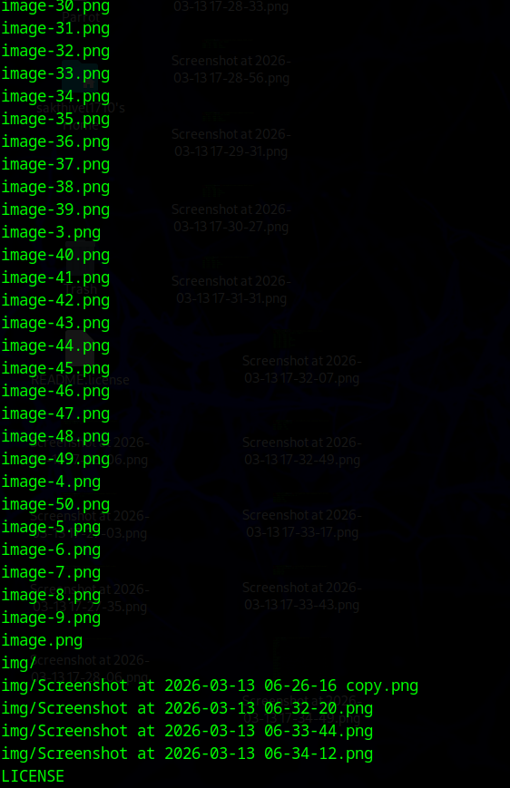

```bash
mkdir backupdir
mv backup.tar backupdir
cd backupdir
tar -tvf backup.tar
```
## OUTPUT
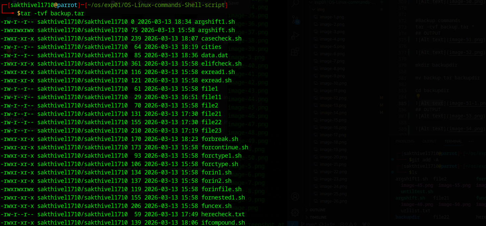


```bash
tar -xvf backup.tar
```
## OUTPUT


```bash
gzip backup.tar
ls *.gz
```
## OUTPUT


```bash
gunzip backup.tar.gz
```
## OUTPUT


---

# Shell Scripts

## Basic Shell Script

```bash
echo '#!/bin/sh' > my-script.sh
echo 'echo Hello World' >> my-script.sh
chmod 755 my-script.sh
./my-script.sh
```
## OUTPUT

---

## Here Document

```bash
cat << stop > herecheck.txt
hello in this world
i cant stop
for this non stop movement
stop
```

```bash
cat herecheck.txt
```
## OUTPUT


---

## Script Parameters (scriptest.sh)

```bash
cat > scriptest.sh
#!/bin/sh
echo "File name is $0 "
echo "File name is " `basename $0`
echo "First arg. is " $1
echo "Second arg. is " $2
echo "Third arg. is " $3
echo "Fourth arg. is " $4
echo 'The $@ is ' $@
echo 'The $# is ' $#
echo 'The $$ is ' $$
ps
^d
```

```bash
chmod 777 scriptest.sh
./scriptest.sh 1 2 3
```
## OUTPUT


---

## Exit Status ($?)

```bash
ls file1
```
## OUTPUT


```bash
echo $?
```
## OUTPUT


```bash
./one
bash: ./one: Permission denied
echo $?
```
## OUTPUT


```bash
abcd
echo $?
```
## OUTPUT


---

## String Comparisons (strcomp.sh)

```bash
cat > strcomp.sh
#!/bin/bash
val1=baseball
val2=hockey
if [ $val1 \> $val2 ]
then
echo "$val1 is greater than $val2"
else
echo "$val1 is less than $val2"
fi
^d
```

## OUTPUT


```bash
chmod 755 strcomp.sh
./strcomp.sh
```
## OUTPUT


---

## Check File Ownership (psswdperm.sh)

```bash
cat > psswdperm.sh
#!/bin/bash
if [ -O /etc/passwd ]
then
echo "You are the owner of the /etc/passwd file"
else
echo "Sorry, you are not the owner of the /etc/passwd file"
fi
^d
```

```bash
chmod 755 psswdperm.sh
./psswdperm.sh
```
## OUTPUT


---

## Nested if - File Location Check (ifnested.sh)

```bash
cat > ifnested.sh
#!/bin/bash
if [ -e $HOME ]
then
echo "$HOME The object exists, is it a file?"
if [ -f $HOME ]
then
echo "Yes,$HOME it is a file!"
else
echo "No,$HOME it is not a file!"
if [ -f $HOME/.bash_history ]
then
echo "But $HOME/.bash_history is a file!"
fi
fi
else
echo "Sorry, the object does not exist"
fi
^d
```

```bash
chmod 755 ifnested.sh
./ifnested.sh
```
## OUTPUT


---

## Numeric Test Comparisons (iftest.sh)

```bash
cat > iftest.sh
#!/bin/bash
val1=10
val2=11
if [ $val1 -gt 5 ]
then
echo "The test value $val1 is greater than 5"
fi
if [ $val1 -eq $val2 ]
then
echo "The values are equal"
else
echo "The values are different"
fi
^d
```

```bash
chmod 755 iftest.sh
./iftest.sh
```
## OUTPUT


---

## Check if a File (ifnested.sh)

```bash
chmod 755 ifnested.sh
./ifnested.sh
```
## OUTPUT


---

## elif Check (elifcheck.sh)

```bash
cat > elifcheck.sh
#!/bin/bash
if [ $USER = Ram ]
then
echo "Welcome $USER"
echo "Please enjoy your visit"
elif [ $USER = Rahim ]
then
echo "Welcome $USER"
echo "Please enjoy your visit"
elif [ $USER = Robert ]
then
echo "Special testing account"
elif [ $USER = gganesh ]
then
echo "$USER, Do not forget to logout when you're done"
else
echo "Sorry, you are not allowed here"
fi
^d
```

```bash
chmod 755 elifcheck.sh
./elifcheck.sh
```
## OUTPUT


---

## Compound Comparisons (ifcompound.sh)

```bash
cat > ifcompound.sh
#!/bin/bash
if [ -d $HOME ] && [ -w $HOME ]
then
echo "The file exists and you can write to it"
else
echo "I cannot write to the file"
fi
^d
```

```bash
chmod 755 ifcompound.sh
./ifcompound.sh
```
## OUTPUT


---

## case Command (casecheck.sh)

```bash
cat > casecheck.sh
case $USER in
Ram | Robert)
echo "Welcome, $USER"
echo "Please enjoy your visit";;
Rahim)
echo "Special testing account";;
gganesh)
echo "$USER, Do not forget to log off when you're done";;
*)
echo "Sorry, you are not allowed here";;
esac
^d
```

```bash
chmod 755 casecheck.sh
./casecheck.sh
```
## OUTPUT


---

## while Loop (whiletest.sh)

```bash
cat > whiletest.sh
#!/bin/bash
# while command test
var1=10
while [ $var1 -gt 0 ]
do
echo $var1
var1=$[ $var1 - 1 ]
done
^d
```

```bash
chmod 755 whiletest.sh
./whiletest.sh
```
## OUTPUT


---

## until Loop (untiltest.sh)

```bash
cat > untiltest.sh
#!/bin/bash
# using the until command
var1=100
until [ $var1 -eq 0 ]
do
echo $var1
var1=$[ $var1 - 25 ]
done
^d
```

```bash
chmod 755 untiltest.sh
./untiltest.sh
```

---

## for-in Loop (forin1.sh)

```bash
cat > forin1.sh
#!/bin/bash
# basic for command
for test in Alabama Alaska Arizona Arkansas California Colorado
do
echo The next state is $test
done
^d
```

```bash
chmod 755 forin1.sh
./forin1.sh
```

---

## for Loop with Apostrophe Handling (forin2.sh)

```bash
cat > forin2.sh
#!/bin/bash
# another example of how not to use the for command
for test in I don't know if this'll work
do
echo "word:$test"
done
^d
```

```bash
chmod 755 forin2.sh
./forin2.sh
```

---

## for Loop with Escaped Quotes (forin3.sh)

```bash
cat > forin3.sh
#!/bin/bash
# another example of how not to use the for command
for test in I don\'t know if "this'll" work
do
echo "word:$test"
done
^d
```

```bash
chmod 755 forin3.sh
./forin3.sh
```

---

## for Loop Reading from File (forinfile.sh)

```bash
cat > cities
Hyderabad
Alampur
Basara
Warangal
Adilabad
Bhadrachalam
Khammam
^d
```

```bash
cat > forinfile.sh
#!/bin/bash
# reading values from a file
file="cities"
for state in `cat $file`
do
echo "Visit beautiful $state"
done
^d
```

```bash
chmod 777 forinfile.sh
./forinfile.sh
```
## OUTPUT


---

## C-style for Loop (forctype.sh)

```bash
cat > forctype.sh
#!/bin/bash
# testing the C-style for loop
for (( i=1; i <= 5; i++ ))
do
echo "The value of i is $i"
done
^d
```

```bash
chmod 755 forctype.sh
./forctype.sh
```
## OUTPUT


---

## Multiple Variables in for Loop (forctype1.sh)

```bash
cat > forctype1.sh
#!/bin/bash
# multiple variables
for (( a=1, b=5; a <= 5; a++, b-- ))
do
echo "$a - $b"
done
^d
```

```bash
chmod 755 forctype1.sh
./forctype1.sh
```
## OUTPUT


---

## Nested for Loop (fornested1.sh)

```bash
cat > fornested1.sh
#!/bin/bash
# nesting for loops
for (( a = 1; a <= 3; a++ ))
do
echo "Starting loop $a:"
for (( b = 1; b <= 3; b++ ))
do
echo "  Inside loop: $b"
done
done
^d
```

```bash
chmod 755 fornested1.sh
./fornested1.sh
```
## OUTPUT


---

## break Statement (forbreak.sh)

```bash
cat > forbreak.sh
#!/bin/bash
# breaking out of a for loop
for var1 in 1 2 3 4 5
do
if [ $var1 -eq 3 ]
then
break
fi
echo "Iteration number: $var1"
done
echo "The for loop is completed"
^d
```

```bash
chmod 755 forbreak.sh
./forbreak.sh
```
## OUTPUT


---

## continue Statement (forcontinue.sh)

```bash
cat > forcontinue.sh
#!/bin/bash
# using continue in a for loop
for var1 in 1 2 3 4 5
do
if [ $var1 -eq 3 ]
then
continue
fi
echo "Iteration number: $var1"
done
echo "The for loop is completed"
^d
```

```bash
chmod 755 forcontinue.sh
./forcontinue.sh
```
## OUTPUT


---

## read Command (exread.sh)

```bash
cat > exread.sh
#!/bin/bash
# testing the read command
echo -n "Enter your name: "
read name
echo "Hello $name, welcome to my program. "
^d
```

```bash
chmod 755 exread.sh
./exread.sh
```
## OUTPUT


---

## read with Prompt (exread1.sh)

```bash
cat > exread1.sh
#!/bin/bash
# testing the read command
read -p "Enter your name: " name
echo "Hello $name, welcome to my program. "
^d
```

```bash
chmod 755 exread1.sh
./exread1.sh
```
## OUTPUT


---

## Function with Parameters (funcex.sh)

```bash
cat > funcex.sh
#!/bin/bash
# trying to access script parameters inside a function
function func {
echo $[ $1 * $2 ]
}
if [ $# -eq 2 ]
then
value=`func $1 $2`
echo "The result is $value"
else
echo "Usage: badtest1 a b"
fi
^d
```

```bash
chmod 755 funcex.sh
./funcex.sh
```
## OUTPUT


```bash
./funcex.sh 1 2
```
## OUTPUT


---

## Argument Shift (argshift.sh)

```bash
cat > argshift.sh
#!/bin/bash
while (( "$#" )); do
  echo $1
  shift
done
^d
```

```bash
chmod 777 argshift.sh
./argshift.sh 1 2 3
```
## OUTPUT


---

## Argument Array (argshift1.sh)

```bash
cat > argshift1.sh
#!/bin/bash
# store arguments in a special array
args=("$@")
# get number of elements
ELEMENTS=${#args[@]}
# echo each element in array
# for loop
for (( i=0;i<$ELEMENTS;i++)); do
    echo ${args[${i}]}
done
^d
```

```bash
chmod 777 argshift1.sh
./argshift1.sh 1 2 3
```
## OUTPUT


---

## Argument Shift with Debug Mode (set -x)

```bash
cat > argshift.sh
#!/bin/bash
set -x
while (( "$#" )); do
  echo $1
  shift
done
set +x
^d
```

```bash
./argshift.sh 1 2 3
```
## OUTPUT


---

## AWK Script - Word and Character Count (nc.awk)

```bash
cat > nc.awk
BEGIN{}
{
print len=length($0),"\t",$0
wordcount+=NF
chrcnt+=len
}
END {
print "total characters",chrcnt
print "Number of Lines are",NR
print "No of Words count:",wordcount
}
^d
```

```bash
cat > data.dat
bcdfghj
abcdfghj
bcdfghj
ebcdfghj
bcdfghj
ibcdfghj
bcdfghj
obcdfghj
bcdfghj
ubcdfghj
^d
```

```bash
awk -f nc.awk data.dat
```
## OUTPUT


---

## Palindrome Check (palindrome.sh)

```bash
cat > palindrome.sh
#!/bin/bash
echo "Enter the number"
read num
s=0
rev=""
temp=$num
while [ $num -gt 0 ]
do
	# Get Remainder
	s=$(( $num % 10 ))
	# Get next digit
	num=$(( $num / 10 ))
	# Store previous number and
	# current digit in reverse
	rev=$( echo ${rev}${s} )
done
if [ $temp -eq $rev ];
then
	echo "Number is palindrome"
else
	echo "Number is NOT palindrome"
fi
^d
```

```bash
chmod 755 palindrome.sh
./palindrome.sh
```
## OUTPUT


---

# RESULT
The Commands are executed successfully.
